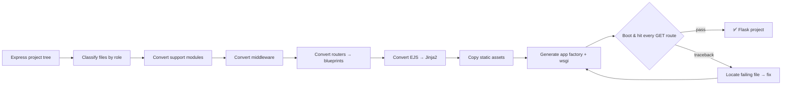

<div align="center">

# 🚀 CodePorter

### Local-LLM agent that migrates whole **Node.js / Express** projects into working **Python / Flask** — with a self-correcting test loop

<br/>

[](https://www.python.org/)
[](https://flask.palletsprojects.com/)
[](https://expressjs.com/)
[](https://github.com/ml-explore/mlx)
[](https://github.com/QwenLM/Qwen3)

<br/>

**Licenses used across the stack**

[](#-license)
[](https://github.com/pallets/flask/blob/main/LICENSE.txt)
[](https://github.com/expressjs/express/blob/master/LICENSE)
[](https://github.com/ml-explore/mlx/blob/main/LICENSE)
[](https://github.com/mde/ejs/blob/main/LICENSE)
[](https://github.com/QwenLM/Qwen3/blob/main/LICENSE)

</div>

---

## 📖 Overview

**CodePorter** is an agentic code-migration tool. Point it at an Express project tree and it
emits a complete, runnable **Flask package** — application factory, blueprints, middleware,
Jinja2 templates, and copied static assets — using a **Qwen3-8B** model running **fully
locally** on Apple Silicon via [MLX](https://github.com/ml-explore/mlx). No cloud, no API keys.

What makes it more than a one-shot prompt: after generating the project it **boots the whole
app in a subprocess, hits every route**, and if anything fails it maps the traceback back to
the exact generated file and asks the model to repair *that* file — looping until the app runs.

---

## ✨ Features

- 🗂️ **Whole-project migration** — routers, middleware, support modules, EJS views and
  `public/` assets, not just a single file.
- 🧩 **Faithful Flask layout** — app factory + one blueprint per Express router, mounted at the
  same URL prefixes parsed from `server.js`.
- 🎨 **EJS → Jinja2** template conversion (`<%= %>` → `{{ }}`, includes, loops, conditionals).
- 📦 **Static assets copied verbatim** — CSS/JS/images are never wasted on the model.
- 🔁 **Self-correcting loop** — boots the app, walks `url_map`, and does **targeted per-file
  repair** from real tracebacks.
- 🔒 **100% local & private** — runs on your Mac through MLX; nothing leaves the machine.

---

## 🏗️ How it works



Files are converted **in dependency order** so later files receive the *already-converted*
names of earlier ones as context — the key to coherent multi-file output on an 8B model. The
application factory is generated **deterministically** from the parsed router mounts, so
blueprint wiring is always consistent.

---

## 🧰 Tech stack

| Layer | Technology | License |
|-------|------------|---------|
| Runtime | Python 3.12 | PSF |
| Inference | Apple **MLX** + `mlx-lm` | MIT |
| Model | **Qwen3-8B** | Apache-2.0 |
| Target framework | **Flask** + Flask-CORS | BSD-3-Clause |
| Source framework | **Express** (sample) | MIT |
| Source views | **EJS** (sample) | Apache-2.0 |

---

## 📂 Project structure

```
codeporter/
├── app.py                 # ⭐ the converter agent
├── mac_test.py            # tiny MLX smoke test (loads the model, streams one prompt)
├── node_js_files/         # 📥 INPUT: sample medium Express "Notes" app
│   ├── server.js
│   ├── routes/            # web.js (pages) + api.js (REST)
│   ├── middleware/        # logger.js (global) + auth.js (per-route)
│   ├── data/store.js      # in-memory store
│   ├── views/             # EJS templates + partials
│   └── public/            # css/ + js/
└── outputs/               # 📤 OUTPUT: generated <project>_flask/ package
    └── node_js_files_flask/
        ├── app/
        │   ├── __init__.py    # application factory (generated)
        │   ├── web.py, api.py # blueprints
        │   ├── middleware.py, store.py
        │   ├── templates/     # Jinja2 views
        │   └── static/        # copied css/js
        ├── wsgi.py
        └── requirements.txt
```

---

## ✅ Prerequisites

- **macOS on Apple Silicon** (MLX requirement)
- **Python 3.12** with `mlx-lm`, `flask`, `flask-cors` (the bundled `mlx-env/` virtualenv already has these)
- **Node.js** (only to run the sample Express input)
- A local **Qwen3-8B** MLX model. Update `MODEL_PATH` in [`app.py`](app.py) to point at it
  (default: `/Volumes/SAMSUNG T20/models/qwen3-8b`).

---

## ⚙️ Installation

```bash
# clone
git clone <your-repo-url> codeporter
cd codeporter

# Python side (or reuse the bundled mlx-env/)
python3 -m venv mlx-env
./mlx-env/bin/pip install mlx-lm flask flask-cors

# Node side — only needed to run the sample Express app
cd node_js_files && npm install && cd ..
```

---

## 🚀 Usage

### 1 — (Optional) Run the sample Express input

```bash
cd node_js_files
npm start          # -> http://localhost:3000
```

```bash
curl localhost:3000/api/notes        # JSON API
open  http://localhost:3000/         # server-rendered pages
```

### 2 — Convert the project to Flask

```bash
./mlx-env/bin/python app.py
```

The agent classifies every file, converts each in dependency order (streaming the model's
output live), assembles the Flask package, then runs the boot-and-probe smoke test with
automatic repair. Result is written to `outputs/node_js_files_flask/`.

### 3 — Run the generated Flask app

```bash
cd outputs/node_js_files_flask
../../mlx-env/bin/pip install -r requirements.txt
python wsgi.py         # -> http://localhost:5000
```

> **macOS note:** port 5000 is used by AirPlay Receiver. Disable it in
> *System Settings → General → AirDrop & Handoff*, or change the port in `wsgi.py`.

---

## 🔧 Configuration

All settings live at the top of [`app.py`](app.py):

| Setting | Default | Purpose |
|---------|---------|---------|
| `MODEL_PATH` | `/Volumes/SAMSUNG T20/models/qwen3-8b` | Path to the local MLX model |
| `INPUT_DIR` | `node_js_files` | Express project to convert |
| `OUTPUT_DIR` | `outputs` | Where the `<project>_flask/` package is written |
| `MAX_TOKENS` | `4096` | Generation budget per file |
| `MAX_FIX_ATTEMPTS` | `4` | Smoke-test + repair rounds before giving up |

---

## 🧠 The self-correction loop

1. Assemble the full Flask tree to disk.
2. Drop a `_smoke.py` runner and execute it in a **subprocess** (`from app import create_app`).
3. Enumerate `app.url_map` and issue a `GET` to every route (dynamic segments filled with
   dummy values) — catching import errors, missing templates, and HTTP 500s.
4. On failure, parse the traceback to find the **specific generated file** at fault and send
   it back to the model with the error for a focused fix.
5. Re-assemble and retest, up to `MAX_FIX_ATTEMPTS`.

---

## 🧩 Extending to your own project

CodePorter enforces small naming **contracts** so the deterministic factory can wire things:

- Blueprints must define `bp = Blueprint('<name>', __name__)`.
- `middleware.py` must expose `log_request()` and `require_api_key(f)`.

Unusual layouts may need the rules in `classify()` ([`app.py`](app.py)) extended to recognize
extra directories (e.g. `controllers/`, `models/`).

---

## 📜 License

This project is released under the **MIT License** — add a `LICENSE` file to formalize it.
Third-party components retain their own licenses, summarized in the badges above
(Flask · BSD-3-Clause, Express/MLX · MIT, EJS/Qwen3 · Apache-2.0).

---

## 🙏 Acknowledgements

- [Apple MLX](https://github.com/ml-explore/mlx) & [`mlx-lm`](https://github.com/ml-explore/mlx-lm) — local inference on Apple Silicon
- [Qwen3](https://github.com/QwenLM/Qwen3) — the migration model
- [Flask](https://flask.palletsprojects.com/) · [Express](https://expressjs.com/) · [EJS](https://ejs.co/)

<div align="center">
<br/>
<sub>Built with ❤️ for local, private code migration.</sub>
</div>
